   

This repository includes various Numerical Method Solutions that are implemented in Python

 
<table>
    <caption style="caption-side:top"><strong>Table of Contents</strong>
    </caption>
    <tr>
        <th>1</th>
        <td>find 32-bit representation of a number</td>
    </tr>
    <tr>
        <th>2</th>
        <td>find ieee-754-single-precision-floating-point-format with its rounding-error</td>
    </tr>
    <tr>
        <th>3</th>
        <td>find min. required # of terms to get 3 correct significant digits of pi by iteration</td>
    </tr>
    <tr>
        <th>4</th>
        <td>find the point of a beam at which max deflection occurs by using bisection method</td>
    </tr>
    <tr>
        <th>5</th>
        <td>for a given data set, fit the data with a straight line using least-square-regression</td>
    </tr>
    <tr>
        <th>6</th>
        <td>for a given data set, fit these experimental data with a power equation based on log transformation using least-square-regression</td>
    </tr>
    <tr>
        <th>7</th>
        <td>given ln8 and ln12, interpolate ln10 by using Newton's 1st Order Polynomial(linear interpolation), find its % relative error</td>
    </tr>
    <tr>
        <th>8</th>
        <td>given ln9 and ln11, interpolate ln10 by using Newton's 1st Order Polynomial(linear interpolation), find its % relative error</td>
    </tr>
    <tr>
        <th>9</th>
        <td>given ln8, ln9 and ln11, interpolate ln10 by using Newton's 2nd Order Polynomial(quadratic interpolation), find its % relative error</td>
    </tr>
    <tr>
        <th>10</th>
        <td>given ln8, ln9, ln11 and ln12, interpolate ln10 by using Newton's 3rd Order Polynomial(cubic interpolation), find its % relative error</td>
    </tr>
    <tr>
        <th>11</th>
        <td>find integral using trapezodial rule and simpson's rule(i used 1 trapezodial rule + 2 3/8 simpsons rule)</td>
    </tr>
     <tr>
        <th>12</th>
        <td>for a given function, compare backward, forward, and central difference approximation methods, with step size ∆x varying. Plot the true relative error as a function of ∆x for each method. Verify that the central difference approximation has small relative true error especially with lower ∆x values</td>
    </tr>
</table>
 

   

How to get users input as integer and calculate the 32-bit integer representation of it?

 

<b>1-*.py</b> gives the 4bytes (32bits) representation:

  

   

The standard IEEE 754 single-precision floating point format uses 32 bits for a floating point
    number: one sign bit, 8 bits for the exponent, and the remaining 23 bits for the mantissa.
    If the exponent and the mantissa are denoted by E and M , the number is given by the formula: ±1.M × (2)^(E-127)

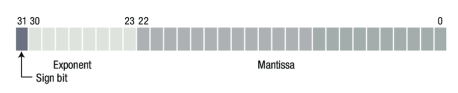

where the number is positive if the sign bit is 0 and negative otherwise. Note that here the exponent
    E is an unsigned (positive) binary number with no sign bit.

    How to calculate the representation of users input integer in this IEEE 754 single precision floating point format?
    If it can not be represented exactly, how much rounding error is there?

  

<b>2-*.py</b> results in:

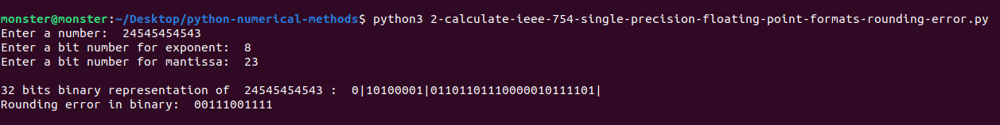
  

   

A well-known infinite sum to determine the value of π is:

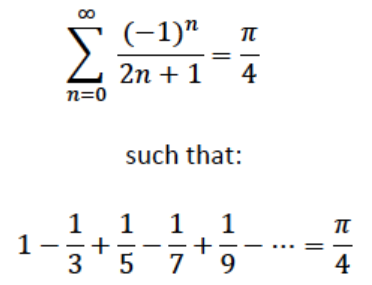

    How many terms do we need to use to obtain three correct significant digits for π?

  

<b>3-*.py</b> results in:

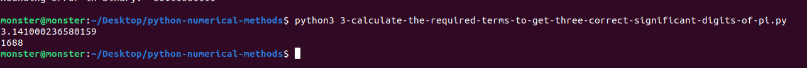
  

   

The deflection y(x) of the beam shown in the figure is
    y(x) = [ (w0) / (120EIL) ] (−(x^5) + 2(L^2)(x^3) − (L^4)x)
    where L = 600 cm, E = 50000 kN/(cm^2) , I = 30000 cm^4 , and w0 = 2.5 kN/cm.
    The maximum deflection of the beam is observed at the location where dy/dx is zero.

<figure>
    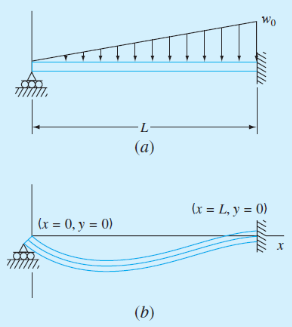
    <figcaption>[Adapted from S.C. Chapra, Applied Numerical Methods with MATLAB, McGraw-Hill, 2012] </figcaption>
</figure>

How to determine the point of maximum deflection using the bisection method?
    Define an appropriate error criterion to stop the iterations.

  

<b>4-*.py</b> results in:

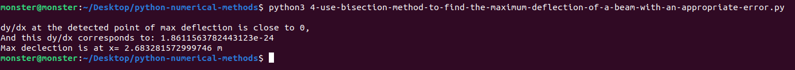
  

   

If we were to given experimental data of f(v)=F as below:

<table>
    <caption style="caption-side:bottom">Experimental Data Results
    </caption>
    <tr>
        <th>v (m/s)</th>
        <td>10</td>
        <td>20</td>
        <td>30</td>
        <td>40</td>
        <td>50</td>
        <td>60</td>
        <td>70</td>
        <td>80</td>
    </tr>
    <tr>
        <th>F (N)</th>
        <td>25</td>
        <td>70</td>
        <td>380</td>
        <td>550</td>
        <td>610</td>
        <td>1220</td>
        <td>830</td>
        <td>1450</td>
    </tr>
</table>

How to fit these data with a straight line using least square regression, and display it graphically?

  

<b>5-*.py</b> gives the equation as:

    y=a0+a1*x

y= -234.28571428571422 + 19.470238095238095 x

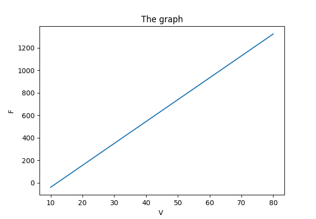
  

   

If we were to given experimental data of f(v)=F as below:

<table>
    <caption style="caption-side:bottom">Experimental Data Results
    </caption>
    <tr>
        <th>v (m/s)</th>
        <td>10</td>
        <td>20</td>
        <td>30</td>
        <td>40</td>
        <td>50</td>
        <td>60</td>
        <td>70</td>
        <td>80</td>
    </tr>
    <tr>
        <th>F (N)</th>
        <td>25</td>
        <td>70</td>
        <td>380</td>
        <td>550</td>
        <td>610</td>
        <td>1220</td>
        <td>830</td>
        <td>1450</td>
    </tr>
</table>

How to fit these data with a power equation y=a(x^b) based on log transformations using least square regression, and
    display it in a graph?

  

<b>6-*.py</b> gives the equation as:

y= 0.2741373420132209 * x^ 1.984176255764013

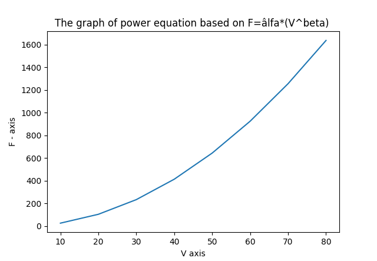
  

   

The natural logarithm of 10 = ln10 and can be obtained by a single line of code, but knowing only ln 8 = 2.0794415, ln
    12 = 2.4849066, and using Newtons 1st Order Polynomial, how to estimate(interpolate) ln10, and what is the percent
    relative error based on the true value of ln10?

  

<b>7-*.py</b> interpolates and the result:

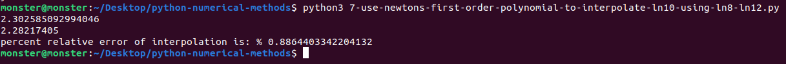
  

   

The natural logarithm of 10 is ln10 and can be obtained by a single line of code, but knowing only ln 9 = 2.1972246,
    ln 11 = 2.3978953, and using Newtons 1st Order Polynomial, how to estimate(interpolate) ln10, and what is the
    percent relative error based on the true value of ln10?

  

<b>8-*.py</b> interpolates and the result:

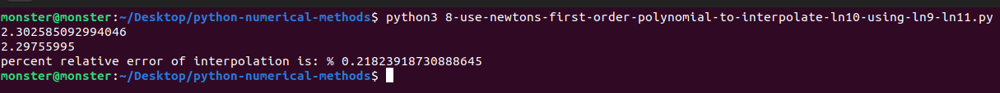
  

   

The natural logarithm of 10 = ln10 and can be obtained by a single line of code, but knowing only ln 8 = 2.0794415, ln
    9 = 2.1972246, ln 11 = 2.3978953, and using Newtons 2nd Order Polynomial, how to estimate(interpolate) ln10, and
    what is the percent relative error based on the true value of ln10?

  

<b>9-*.py</b> interpolates and the result is:

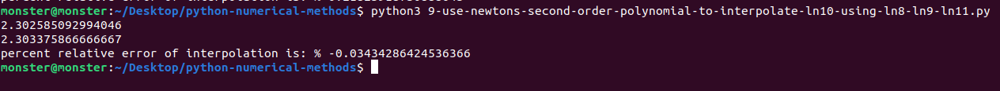
  

   

The natural logarithm of 10 = ln10 and can be obtained by a single line of code, but knowing only ln 8 = 2.0794415, ln
    9 = 2.1972246, ln 11 = 2.3978953, ln 12 = 2.4849066, and using Newtons 3rd Order Polynomial, how to
    estimate(interpolate) ln10, and what is the percent relative error based on the true value of ln10?

  

<b>10-*.py</b> interpolates and the result:

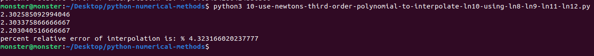
  

   

If we had arbitrary 7 experimental data points, we could fit a 6th degree polynomial(or less) to those 7 data
    points, and even estimate the maximum data points of that 6th degree curve easily as we did it in the deflection of
    beam example above. All it requires is roughly 100 lines of code and we get the curve of any experimental data
    points. Wow, how powerful Python is fascinates. Let's continue for some other numerical calculations.

 

If a springs force was measured at each step as it is stretched:

<table>
    <tr>
        <th>F (N)</th>
        <td>0</td>
        <td>10</td>
        <td>28</td>
        <td>46</td>
        <td>63</td>
        <td>82</td>
        <td>110</td>
        <td>130</td>
    </tr>
    <tr>
        <th>x (m)</th>
        <td>0</td>
        <td>0.05</td>
        <td>0.10</td>
        <td>0.15</td>
        <td>0.20</td>
        <td>0.25</td>
        <td>0.30</td>
        <td>0.35</td>
    </tr>
</table>

How to calculate the work done by stretching spring to x=0.35m?

  

In such cases where data is evenly measured, simpson rule is the best option, even better than polynomial curve
    fitting(requires additional unnecessary calculation which will put extra load on cpu and the data set might not
    necessarily be fitted to a 7th order curve!) or trapezodial rule. While trapezodial rule gives the exact result for
    a polynomial of degree 1, Simpson 1/3 rule gives the exact result for a polynomial of degree 2. On the other hand,
    Simpson 3/8 rule gives the exact result for a polynomial of degree 3.

I preferred a combination of trapezodial and 3/8 Simpson for the sake of having diversity of rules.

<b>11-*.py</b> results in:

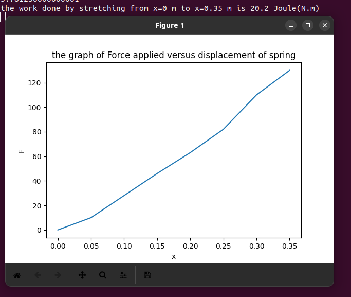
  

   

Find the derivative of the function f (x) = (e^(−2x)) −x at x = 2, using backward, forward,
    and central difference approximation methods, with step size ∆x varying between 0.01 and 0.5 with
    increments of 0.01 units. For each method, <b>plot the true relative error</b> as a function of ∆x, and verify
    that the <b>central difference approximation</b> gives small error especially for small ∆x values.

  

    <b>12-*.py</b> results in:

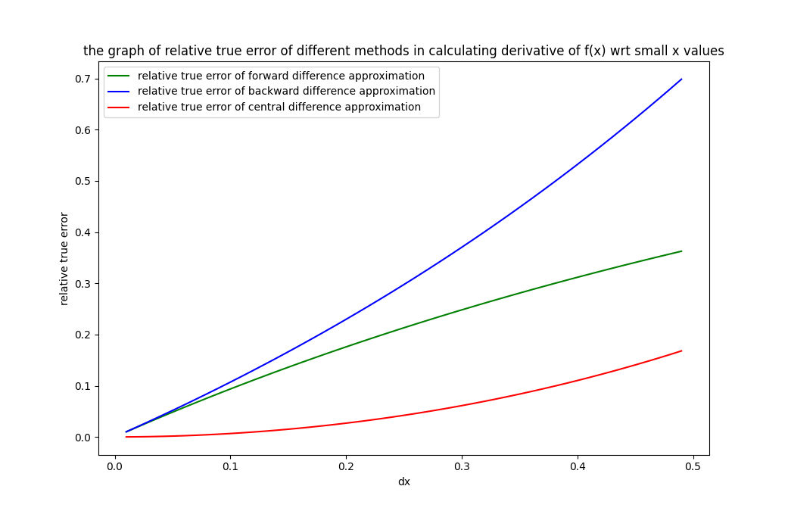